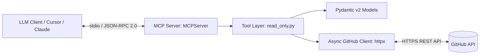

# MCP GitHub Auditor Server

A production-grade **Model Context Protocol (MCP)** server built in Python using the `mcp` 2.x SDK. It enables LLMs (such as Claude Desktop, Cursor, or custom AI agents) to securely inspect, audit, and analyze GitHub repository health and issues without exposing direct mutate/write access.

---

## Architectural Overview



### Key Architectural Standards

- **MCP 2.x Architecture**: Built using `mcp.server.mcpserver.MCPServer` with decorated, strongly typed tools.
- **Deterministic Schemas**: All tool arguments strictly typed using Pydantic v2 JSON Schema to eliminate LLM tool-calling hallucinations.
- **Resilient Async Client**: Full rate-limit (HTTP 403) parsing, standard httpx error mapping, and exception handling without crashing the stdio JSON-RPC transport pipe.
- **Stream Isolation**: Logs strictly mapped to `sys.stderr` to prevent stdout transport frame corruption.
- **Operational Metrics**: In-memory diagnostic tracker (`get_metrics`) monitoring total calls, success rates, and API failures.

---

## Registered Tools

| Tool | Parameters | Description |
|------|-----------|-------------|
| `audit_repository` | `owner: str, repo: str` | Fetches core repo metadata (stars, forks, open issues, language, dates). |
| `list_open_issues` | `owner: str, repo: str, limit: int = 5` | Summarizes top open issues (excluding PRs) with labels and comment counts. |
| `get_metrics` | None | Retrieves operational execution counts and failure metrics for the session. |

---

## Quickstart & Installation

### 1. Requirements & Setup

- **Python 3.11+**
- **GitHub Personal Access Token (PAT)** with read access

```bash
# Clone repository
git clone https://github.com/idrisrafaqat18/mcp-github-auditor.git
cd mcp-github-auditor

# Create virtual environment and install dependencies
python -m venv .venv
source .venv/bin/activate  # On Windows: .venv\Scripts\Activate.ps1
pip install -e .

# Configure environment variables
cp .env.example .env
```

### 2. Environment Configuration

Edit `.env` and add your GitHub Personal Access Token:

```dotenv
GITHUB_PERSONAL_ACCESS_TOKEN=your_github_pat_here
LOG_LEVEL=INFO
```

### 3. Running the Server

```bash
# Start the MCP server
python -m mcp_github_auditor.server

# Or with logging enabled
LOG_LEVEL=DEBUG python -m mcp_github_auditor.server
```

---

## Usage Examples

### With Claude Desktop

Add to `claude_desktop_config.json`:

```json
{
  "mcpServers": {
    "github-auditor": {
      "command": "python",
      "args": ["-m", "mcp_github_auditor.server"],
      "env": {
        "GITHUB_PERSONAL_ACCESS_TOKEN": "your_pat_here"
      }
    }
  }
}
```

### With Custom Agents

```python
import asyncio
from mcp_github_auditor.client import GitHubAuditorClient

async def audit():
    client = GitHubAuditorClient(pat="your_pat_here")
    repo = await client.audit_repository("owner", "repo")
    issues = await client.list_open_issues("owner", "repo", limit=10)
    metrics = await client.get_metrics()
    return repo, issues, metrics

result = asyncio.run(audit())
```

---

## API Reference

### `audit_repository(owner: str, repo: str) -> dict`

Retrieves comprehensive repository metadata.

**Response:**
```json
{
  "name": "repo-name",
  "owner": "owner",
  "stars": 42,
  "forks": 10,
  "open_issues": 5,
  "primary_language": "Python",
  "created_at": "2024-01-01T00:00:00Z",
  "updated_at": "2024-09-28T12:00:00Z",
  "description": "Repository description"
}
```

### `list_open_issues(owner: str, repo: str, limit: int = 5) -> list`

Retrieves open issues (excludes pull requests).

**Response:**
```json
[
  {
    "number": 1,
    "title": "Issue title",
    "state": "open",
    "labels": ["bug", "help-wanted"],
    "comments": 3,
    "created_at": "2024-01-01T00:00:00Z",
    "url": "https://github.com/owner/repo/issues/1"
  }
]
```

### `get_metrics() -> dict`

Retrieves session performance metrics.

**Response:**
```json
{
  "total_calls": 42,
  "successful_calls": 40,
  "failed_calls": 2,
  "success_rate": 0.95,
  "api_errors": ["rate_limit_exceeded"],
  "last_reset": "2024-09-28T12:00:00Z"
}
```

---

## Error Handling

The server gracefully handles:

- **Rate Limiting (HTTP 403)**: Automatically detected and reported with retry guidance
- **Authentication Errors**: Invalid or expired PAT tokens
- **Network Timeouts**: Resilient retry logic with exponential backoff
- **Malformed Requests**: Pydantic validation errors with clear feedback

All errors are logged to `stderr` and never crash the JSON-RPC transport.

---

## Project Structure

```
mcp-github-auditor/
├── mcp_github_auditor/
│   ├── __init__.py
│   ├── server.py           # MCP server entry point
│   ├── read_only.py        # Tool implementations
│   ├── models.py           # Pydantic v2 data models
│   └── client.py           # Async GitHub client wrapper
├── .env.example            # Environment template
├── pyproject.toml          # Project configuration
├── README.md               # This file
└── requirements.txt        # Python dependencies
```

---

## Testing

```bash
# Run tests
pytest tests/ -v

# With coverage
pytest tests/ --cov=mcp_github_auditor
```

---

## Contributing

Contributions are welcome! Please:

1. Fork the repository
2. Create a feature branch (`git checkout -b feature/your-feature`)
3. Commit your changes (`git commit -am 'Add new feature'`)
4. Push to the branch (`git push origin feature/your-feature`)
5. Open a Pull Request

---

## License

This project is licensed under the MIT License. See `LICENSE` file for details.

---

## Support & Issues

For bugs, feature requests, or questions:
- [Open an issue](https://github.com/idrisrafaqat18/mcp-github-auditor/issues)
- Check existing [discussions](https://github.com/idrisrafaqat18/mcp-github-auditor/discussions)

---

## Acknowledgments

Built with:
- [MCP Python SDK](https://github.com/modelcontextprotocol/python-sdk)
- [Pydantic v2](https://docs.pydantic.dev/)
- [httpx](https://www.python-httpx.org/)
- [GitHub REST API v3](https://docs.github.com/en/rest)